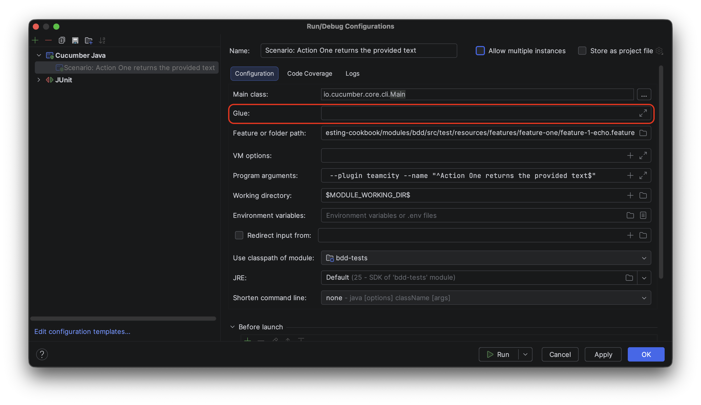
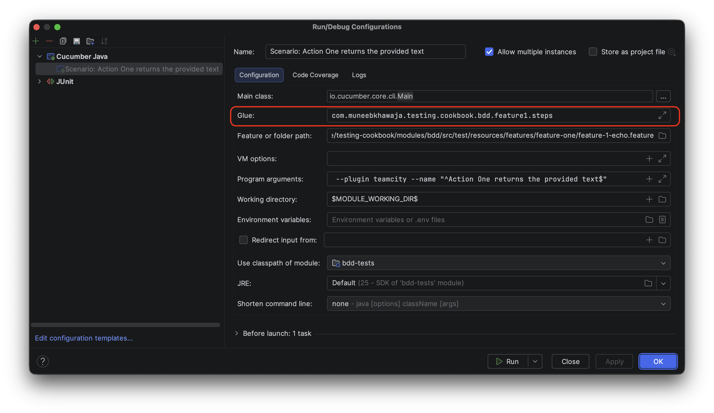

# Behavior Driven Development (BDD) / Cucumber Acceptance Tests

## IDEA Support

For Cucumber Support in IDEA, make sure to install both the Gherkin Plugin and the language-specific cucumber plugin:

- [Gherkin Plugin](https://plugins.jetbrains.com/plugin/9164-gherkin)
- [Cucumber For Java Plugin](https://plugins.jetbrains.com/plugin/7212-cucumber-for-java)

Source: [Gherkin Plugin Reviews and Ratings](https://plugins.jetbrains.com/plugin/9164-gherkin/reviews#129759-129763)

### Troubleshooting IDEA Run Cucumber Run Configurations

#### Please ensure only one class configures the spring context

Sample exception given below:

```plaintext

Please ensure only one class configures the spring context

By default Cucumber scans the entire classpath for context configuration.
You can restrict this by configuring the glue path.
Examples:
 - @CucumberOptions(glue = "com.example.application")
 - @ConfigurationParameter(key = GLUE_PROPERTY_NAME, value = "com.example.application")
 - src/test/resources/junit-platform.properties   cucumber.glue=com.example.application
 - src/test/resources/cucumber.properties         cucumber.glue=com.example.application

		at io.cucumber.spring.SpringFactory.checkOnlyOneClassHasCucumberContextConfiguration(SpringFactory.java:87)
		at io.cucumber.spring.SpringFactory.addClass(SpringFactory.java:62)
        ....
```

- The exception above happens when there are multiple classes found on the glue path that configure the Spring Context via  `io.cucumber.spring.CucumberContextConfiguration`
    - In the example bdd module, there are two such
      classes: [FeatureOneCucumberSpringConfiguration.java](src/test/java/com/muneebkhawaja/testing/cookbook/bdd/feature1/steps/FeatureOneCucumberSpringConfiguration.java)
      and [FeatureTwoCucumberSpringConfiguration.java](src/test/java/com/muneebkhawaja/testing/cookbook/bdd/feature2/steps/FeatureTwoCucumberSpringConfiguration.java)
- Everything works out of the box when you execute tests with maven because the Jupiter suites, i.e.,`@Suite` annotated classes are executed and have distinct glue paths.
    - In the demo bdd module, there are two such suites: [FeatureOneSuite.java](src/test/java/com/muneebkhawaja/testing/cookbook/bdd/feature1/steps/FeatureOneSuite.java)
      and [FeatureTwoSuite.java](src/test/java/com/muneebkhawaja/testing/cookbook/bdd/feature2/steps/FeatureTwoSuite.java)
    - Each of the` @Suite` annotated classes specifies a different glue path (as suggested by the error message). So there are no issues when running with Maven.
- When you run a feature from IntelliJ’s Cucumber run configuration, it uses the Cucumber runner configuration (not the JUnit @Suite), and if glue isn’t set there, it may default to a broad glue root.
    - According to this issue [IDEA-243074](https://youtrack.jetbrains.com/issue/IDEA-243074/Do-not-suggest-glue-packages-for-Cucumber-v6.0.0), the default value for the `glue` field in the Cucumber
      CLI based run configuration is the class path root, which would then pick up all classes annotated with `io.cucumber.spring.CucumberContextConfiguration`. This effectively means "scan
      everything".



- Everything will work as expected if you specify the glue field explicitly (as specified in the `@Suite` classes) in the Cucumber Run Configuration e.g.



## References

- [Gherkin Reference](https://cucumber.io/docs/gherkin/reference)
- [Cucumber Dependency Injection (Spring)](https://cucumber.io/docs/cucumber/state/#spring)
- [Cucumber Spring](https://github.com/cucumber/cucumber-jvm/tree/main/cucumber-spring)
- [#2294 Multiple Spring Contexts](https://github.com/cucumber/cucumber-jvm/issues/2294)
- [Cucumber Jupiter Support](https://github.com/cucumber/cucumber-jvm/tree/main/cucumber-junit-platform-engine)
- [Cucumber configuration error in IntelliJ: Please annotate a glue class with some context configuration](https://stackoverflow.com/questions/74990179/cucumber-configuration-error-in-intellij-please-annotate-a-glue-class-with-some)
- [Cucumber can't find my step definitions in IntelliJ IDEA](https://cucumber.io/docs/faq/#cucumber-cant-find-my-step-definitions-in-intellij-idea)